# CJP Protest Video Wall — Prior-Art & Tech Research (v1)

*Prepared as build-session context for a Claude Code session. Practical and implementation-focused, not a design essay. Everything below is scoped to the design and technical patterns of the reference projects — it does not cover the protest movement itself. Where something couldn't be found or verified, it's flagged plainly rather than guessed.*

**Date compiled:** 21 July 2026
**Screenshots:** in the `screenshots/` subfolder, referenced inline by filename.
**How screenshots were captured:** the reference SPAs (Forensic Architecture, Syrian Archive, Josh Begley, Prison Map, The Intercept) and demos were captured live in a real browser. GitHub repo pages were captured live too. Two intended captures could not be made and are noted at their sections: the Forensic Architecture *Beirut Port Explosion* case page (hero video never finished loading on capture), the Ayotzinapa 3D platform (site was unreachable during the session), and the specific NYT Notre-Dame URL (now a dead link — the Graham Roberts portfolio page covers the same work instead).

---

## 1. Recommendations summary (read this first)

Build v1 as a **static, manifest-driven tile wall**: a flat JSON file (one record per clip) rendered into a native CSS-Grid of cards, filtered entirely client-side. The single most valuable pattern across all three reference projects — and the one to copy most deliberately — is **Mnemonic/Syrian Archive's multi-dimensional verification model**: don't store one `verified` boolean, store independent flags (authenticity-verified, geolocated, chronolocated, source-still-online, public/sensitive, graphic-content) and surface each as its own small badge on the tile, with a provenance chain (hash + source + date) behind it. **Embed, don't rehost** video (Forensic Architecture's approach: a single component that dispatches by source type), using a **lazy "facade" loader** (`lite-youtube-embed`) so a wall of many embeds stays fast. For v1, skip 3D entirely — the gold-standard evidentiary shops (NYT Visual Investigations, Bellingcat, most Forensic Architecture case pages) deliberately ship **pre-rendered video, not interactive WebGL**, and 3D only earns its place when the viewer performs real spatial reasoning. Keep a **map + timeline** (Forensic Architecture's open-source *TimeMap* pattern: Leaflet + D3, 2D) on the roadmap for v2, and reserve any 3D — including a 3D reposting-network graph — as an optional, clearly-justified presentation layer, never the analytical default.

---

## 2. Per-project deep dives

### 2.1 Forensic Architecture — forensic-architecture.org

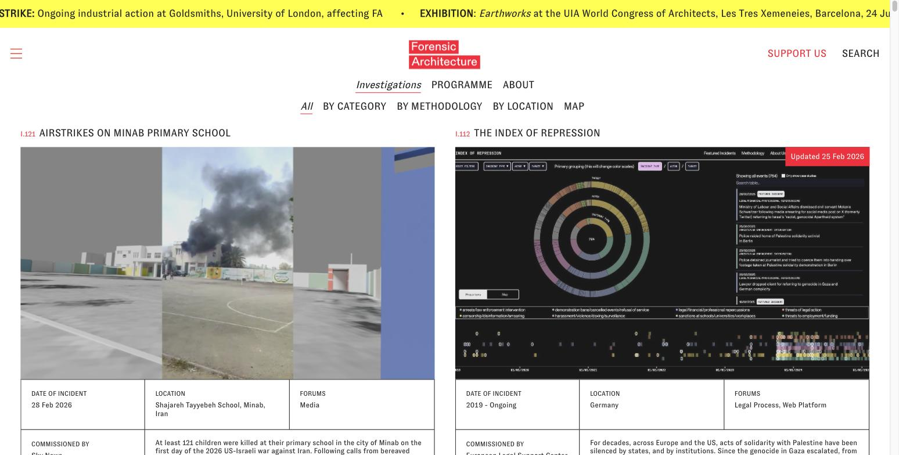
*Homepage = a filterable tile wall of investigation cards (note the "All / By Category / By Methodology / By Location / Map" filter row, and the radial "Index of Repression" viz on the right — their TimeMap tool embedded).*

**What they built & how.** Forensic Architecture (FA) is a research agency at Goldsmiths, University of London that reconstructs incidents of state/corporate violence from open-source media, testimony, and 3D modelling. The live site is a **JavaScript-rendered SPA**. Its structure is directly relevant:

- **Investigations index (homepage)** is effectively a **filterable tile wall of case cards** — thumbnail (key frame or image) + code + title + location/date — with a filter row (All / By Category / By Methodology / By Location / Map). This *is* the tile-wall pattern.
- **Case pages** are long-form vertical-scroll "visual essays": a lead hero video, then alternating blocks of narrative text, embedded video, annotated stills, maps, and image comparisons. See the Saydnaya case page below for the case-page header + metadata table pattern.
- **Video is embedded (Vimeo/YouTube), never rehosted** on the main site.
- Timelines & maps for several investigations are delivered via their own open-source **TimeMap** tool, embedded as an interactive app.

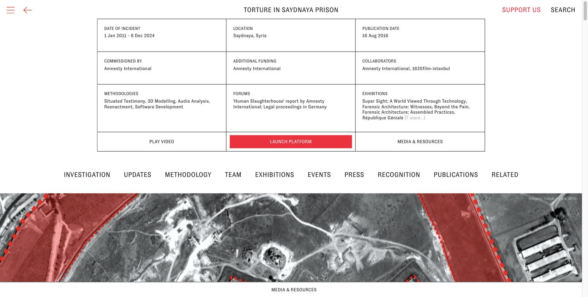
*A representative case page: structured metadata (date, location, methodologies, forums, collaborators), a "Launch Platform"/"Play Video" action row, and a satellite base map with annotated overlays.*

**GitHub / open source.** FA maintains an active org: **github.com/forensic-architecture**. The most reusable repo is **timemap** (github.com/forensic-architecture/timemap) — a map+timeline incident explorer, **React 18 + Redux + D3 v7 + Leaflet + supercluster + video-react**. Captured live: 378 stars, 849 commits, described as "Exploration, monitoring and classification of incidents in time and space." Supporting repos: **datasheet-server** (turns Google Sheets into an API feeding TimeMap), **mtriage** (Python, scrape/analyse media at scale), **telegram-tracker**, and a Storybook **design-system**. The **main marketing site is not open-sourced** — so the tile-wall markup itself is observed from the live site, while the reusable *engineering* is TimeMap.

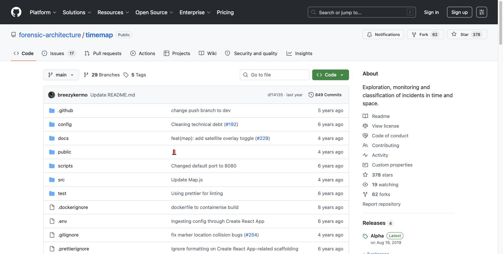

Three short, illustrative snippets from TimeMap (the transferable patterns):

**a) Media embedding by source type — embed-not-rehost, with a privacy placeholder** (`src/components/controls/atoms/Media.js`). One component dispatches on media type; a withheld source still occupies a labelled tile rather than vanishing:
```jsx
const type = typeForPath(src);
switch (type) {
  case "Video":
    return (
      <div className="card-cell media">
        <video onMouseEnter={onVideoStart} onMouseLeave={onVideoStop}
               ref={videoRef} disablePictureInPicture>
          <source src={src} />
        </video>
      </div>
    );
  case "Tweet": {
    const tweetId = /twitter.com\/[0-9a-zA-Z_]{1,20}\/status\/([0-9]*)/.exec(src)[1];
    return <div className="card-cell media embedded"><TwitterTweetEmbed tweetId={tweetId} /></div>;
  }
  default:
    if (src === "HIDDEN")        // source withheld for privacy — still shown as a tile
      return <div className="card-cell media source-hidden"><h4>Source hidden<br/>Privacy concerns</h4></div>;
}
```

**b) Verification/tagging via colour-coded, hierarchical filters** (`src/components/controls/FilterListPanel.js`). Active filter tags get an assigned colour that propagates to tiles/markers — the exact mechanism to repurpose for per-clip verification status:
```jsx
const idxFromColorSet = getFilterIdxFromColorSet(key, coloringSet);
const assignedColor =
  idxFromColorSet !== -1 && activeFilters.includes(key) ? filterColors[idxFromColorSet] : "";
return (
  <li className="filter-filter" style={{ color: assignedColor, marginLeft: `${depth*20}px` }}>
    <Checkbox label={pathLeaf} isActive={activeFilters.includes(key)}
      onClickCheckbox={() => onSelectFilter(key, matchingKeys)} color={assignedColor} />
  </li>
);
```

**c) Data-driven evidence cards** (`src/components/controls/Card.js`) — cards are generated from an event object; each source's paths flatten into media tiles, keeping every clip bound to its incident/date/location:
```jsx
sourced: ({ event }) => [
  [{ kind: "date", title: "Incident Date", value: event.datetime || event.date || `` },
   { kind: "text", title: "Location", value: event.location || `—` }],
  ...event.sources.flatMap((source) =>
    [source.paths.map((p) => ({ kind: "media", title: "Media", value: [{ src: p, title: null }] }))]),
]
```

**WebGL vs pre-rendered 3D — answer: PRE-RENDERED VIDEO, not interactive in-browser WebGL.** This was checked explicitly against FA's own `models` repo: every 3D asset is a desktop-DCC binary — `.blend` (Blender), `.c4d` (Cinema4D), `.ply` (point cloud) — with READMEs instructing you to open them in Blender/Cinema4D. There are **zero web-3D formats** (`.glb`/`.gltf`/`.usdz`) and no Three.js/Babylon/model-viewer anywhere in FA's public code. On case pages the reconstructions therefore appear as **rendered Vimeo/YouTube video** with baked camera moves, plus annotated still renders. The methodology page below shows these reconstructions presented as flat video tiles, confirming the delivery format.

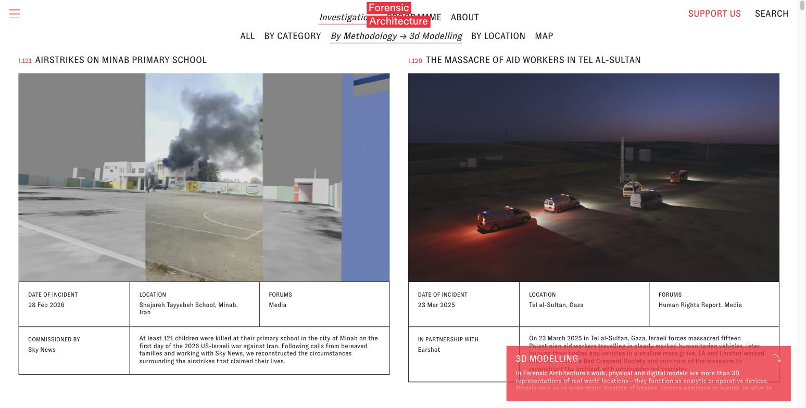
*3D reconstructions (e.g. the Tel al-Sultan scene) shown as rendered video, not navigable WebGL. Implication: FA's cinematic 3D is film-production output, not a reusable web pattern. What's reusable is the 2D layer — the tiled evidence grid, media cards, colour-coded verification filters, and the synchronised map+timeline (TimeMap).*

> **Gap flagged:** the *Beirut Port Explosion* case page was intended as a second case-page screenshot but its hero video never finished loading during capture; the Saydnaya page above covers the same case-page pattern.

**150–250 word summary.** Forensic Architecture reconstructs incidents of state/corporate violence from open-source media and presents them as long-form, media-first visual essays. Its marketing site is a JavaScript SPA whose investigations index is effectively a **filterable tile wall of case cards**; case pages are vertical-scroll narratives interleaving embedded video, annotated stills, and maps. Video is **embedded from Vimeo/YouTube, never rehosted**. Their heavy 3D reconstructions are authored in Blender/Cinema4D and shipped as **pre-rendered video, not interactive WebGL** — so that piece is not a web-reusable pattern. The reusable engineering lives in open-source **TimeMap** (React 18 + Redux + D3 v7 + Leaflet + supercluster). Three patterns transfer directly to a protest-video tile wall: **(1) per-clip status via colour-coded, hierarchical tag filters** (e.g. `verified > geolocated`), toggling to segment the wall — your verification-badge mechanism; **(2) embed-not-rehost media** via a single component that dispatches by source type and renders a labelled placeholder for privacy-withheld sources, preserving provenance; **(3) data-driven evidence cards** generated from event objects whose attached source paths flatten into media tiles, keeping each clip bound to its incident, date, location, and citation.

### 2.2 Josh Begley — joshbegley.com

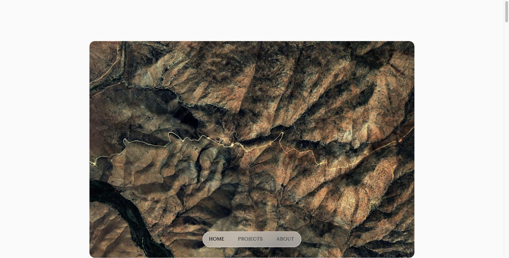
*The landing view: a full-bleed satellite image with a minimal floating nav.*

**What he built & how.** Begley is a data artist whose signature method is **collection-as-argument**: take a database of contested sites, auto-fetch one satellite or Street View image per record, and present the whole set at once so that *sheer scale* carries the message.

- **joshbegley.com** itself is a **responsive CSS-grid of project cards** — a useful reference implementation. Each card is a uniform-aspect-ratio (3/2) image on top, rounded corners (`border-radius:16px`), soft shadow, hover-lift, with Vimeo/Instagram embeds and a lightbox for stills. It collapses `3 → 2 → 1` columns at breakpoints.

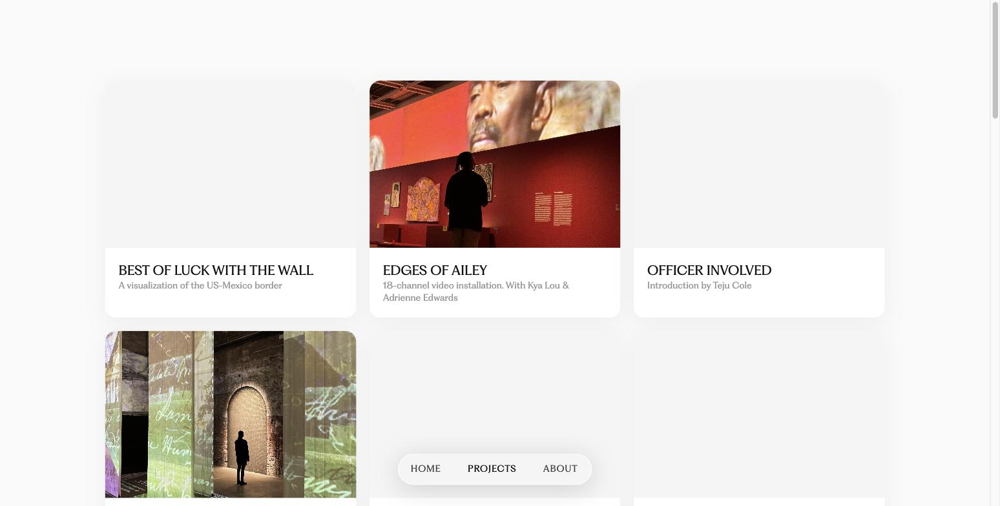
*The projects view is the tile-grid skeleton in miniature: uniform cards, image + title + one-line caption.*

- **Officer Involved (2015)** took **~1,100 locations of police killings** and pulled a Google Maps satellite image of each, presented as **row after row of aerial tiles** — a dense, quiet grid where scale is the message. (The **2016 reprise** is the *video* version: ~1,000 Street-View sites stitched into a single Vimeo sequence, one frame per site. So the same corpus exists as both a tile grid and a stitched linear video.)

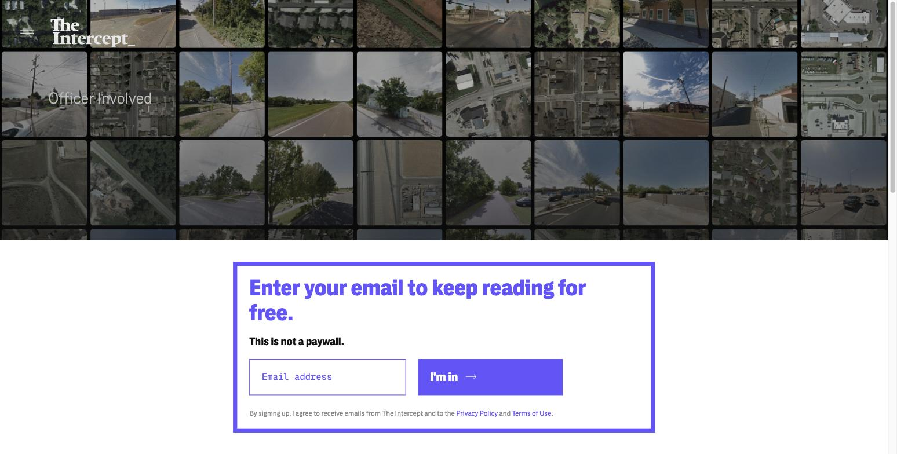
*The definitive "tile wall" reference: a wall of aerial/street-view tiles, one per site. (The email-capture card is The Intercept's, not part of the piece.)*

- **Prison Map (prisonmap.com)** is the closest prior art to a tile wall: **4,900+ satellite images of U.S. prisons** as one massive scrolling wall of `inline-block` 150px lazy-loaded tiles (jQuery Lazyload + a placeholder GIF), each click-to-zoom via Fancybox.

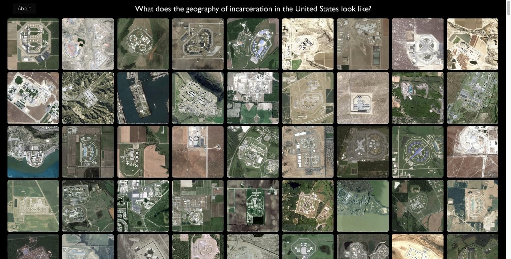
*"What does the geography of incarceration in the United States look like?" — density itself is the statement.*

**GitHub / open source.** His handle is **github.com/joshbegley** (confirmed live). His portfolio front-ends are mostly Intercept-hosted and **not open-sourced**, so there's no repo for the Officer Involved / Prison Map *UI*. The transferable open code is the **image-acquisition** layer:

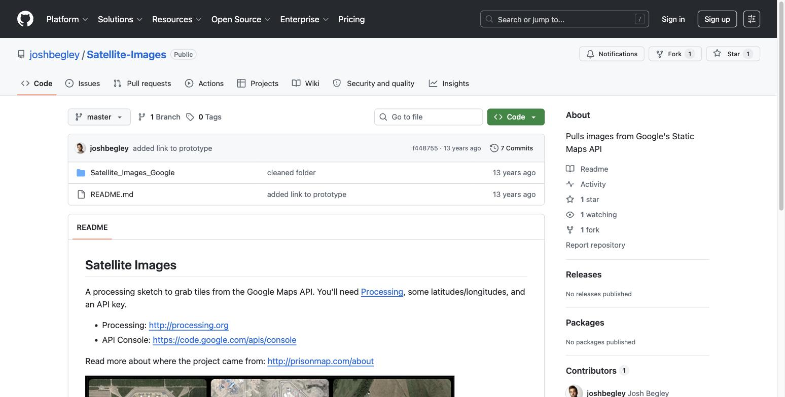

**`joshbegley/Satellite-Images`** — 100% **Processing** (Java-based creative coding). Reads a `data/images.csv` of `lon,lat,id` rows and batch-downloads one satellite JPEG per site from the **Google Static Maps API**. This is literally how the tile imagery was generated (the repo README even links to prisonmap.com/about):
```processing
String zoom = "16";                          // ~facility-level framing
PImage getSatImage(String lat, String lon) {
  String url = "http://maps.googleapis.com/maps/api/staticmap?center="
      + lat + "," + lon + "&zoom=" + zoom
      + "&scale=2&size=640x640&maptype=satellite&sensor=false&key=" + api_key;
  return loadImage(url);
}
// draw(): loop images.csv rows -> getSatImage(lat,lon) -> img.save("img"+id+".jpg")
```
`scale=2` + `size=640x640` yields 1280px retina tiles; images are named by stable `id` so the grid can map tile→record deterministically. (His other public repo, **`joshbegley/NSA-Stories`**, is a data-only repo — a CSV + PDF corpus, no rendering code — useful only as evidence of the "model the collection as a flat manifest, then render" method.)

**150–250 word summary.** Begley's method is collection-as-argument: take a database of contested sites (police killings, prisons, drone strikes, border miles), auto-fetch one satellite/Street-View image per record via the Google Maps API, and show the whole set at once so *scale* carries the message. His pipeline is two clean stages — a batch **image-acquisition** script (the Processing sketch in `Satellite-Images`, driven by a `lon,lat,id` CSV) and a **dense tile presentation** (Prison Map's wall of `inline-block`, lazy-loaded, Fancybox-zoomable tiles; Officer Involved's 1,100-tile grid). The same corpus renders either as an interactive grid *or* as a single stitched linear video. Three patterns transfer directly to a protest-video tile wall: **(1) scale-as-message** — don't sample; show all N clips at once so density itself is the statement; **(2) manifest-driven rendering** — keep a flat CSV/JSON of records (coords, source URL, id) and generate tiles deterministically, id-named so tile↔record mapping is stable; **(3) dual output from one corpus** — the same tile set should support an interactive lazy-loaded grid (lazy-load + click-to-expand lightbox) *and* an ffmpeg-stitched "every frame is one clip" video. Practical UX cues to steal: uniform aspect-ratio tiles, rounded corners, subtle hover, lazy-load with placeholders, click-to-expand lightbox.

> **Honest note:** *Profiling Is Beautiful* (an AP/NYPD-surveillance visualisation) is a data-viz map/list, not a tile wall, and I couldn't retrieve concrete layout detail for it — flagged rather than guessed.

### 2.3 Mnemonic / Syrian Archive — syrianarchive.org

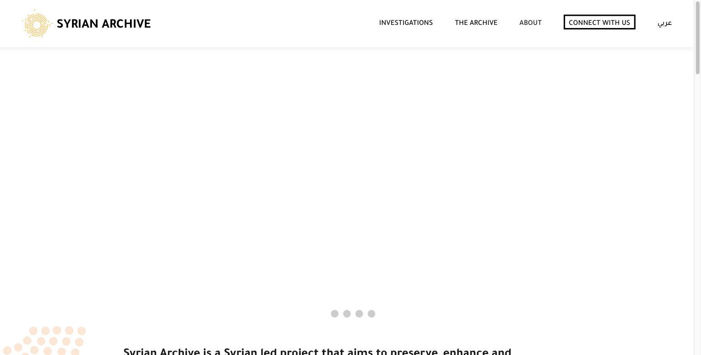

**What they built & how.** Mnemonic is an NGO that archives, verifies, and preserves eyewitness video documenting human-rights violations, so footage survives platform takedowns and can serve as legal evidence. It runs four sibling archives on one shared stack — **Syrian Archive** (flagship), plus Yemeni, Sudanese, and Ukrainian archives — collectively 10M+ records. The pipeline: scrape from YouTube/Twitter/Facebook/Telegram → hash and preserve each file (chain of custody) → three-step human verification (source credibility, geolocation, chronolocation) → publish to a filterable public database.

- The public database renders as a **paginated grid of video cards** (thumbnail, bilingual title, incident date, location, reference code) with a **facet sidebar** whose available values are computed live from the current result set.
- An **Investigations** section presents long-form visual-essay pages and downloadable **datasets** as a card grid.

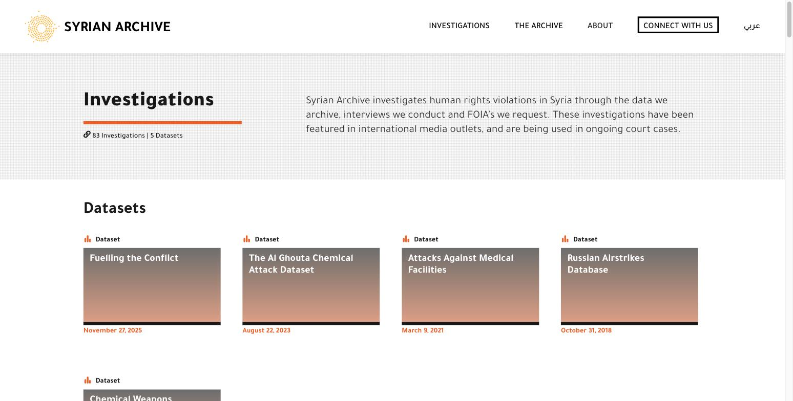
*Investigations + datasets as cards (Fuelling the Conflict, Al Ghouta Chemical Attack, Attacks Against Medical Facilities, Russian Airstrikes Database), each dated.*

The **real database view** lives under "The Archive" (`/en/data-archive/?type=incidents`) — this is the single most relevant screen for your project:

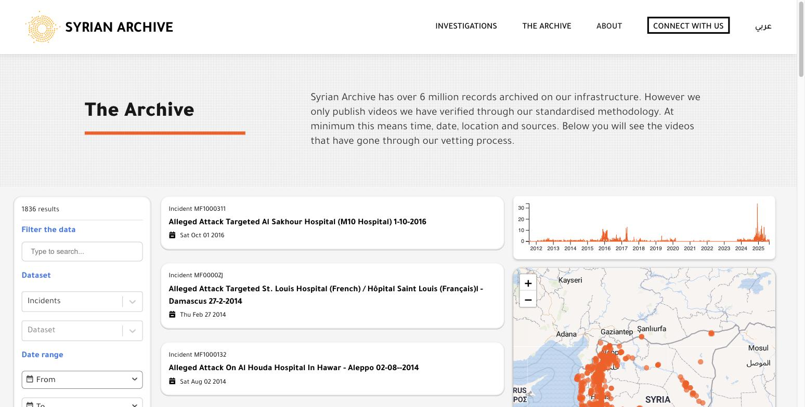
*Left: **result count + faceted filters** (fuzzy search, Dataset dropdown, date range). Middle: **incident cards** (reference code + title + date). Right: a **timeline histogram (2012–2025)** and a **clustered map**. This is exactly the filter + card-grid + map + timeline composition to model v1/v2 on.*

> **URL correction:** the earlier research guessed `/en/database` and `/en/collections` — both **404**. The live database is `/en/data-archive/` (reached via the "The Archive" nav item). Use that.

**GitHub / open source (they open-source their tooling).** Two orgs: **github.com/mnemonicorg** and **github.com/syrianarchive** (GPL-3.0, mostly JavaScript/Node, `lodash/fp` functional style). The **front-end web app itself is NOT open-sourced** — only the API and data pipeline — so the exact tile markup is observed from the live site, but the *data model and filter logic* are readable in code.

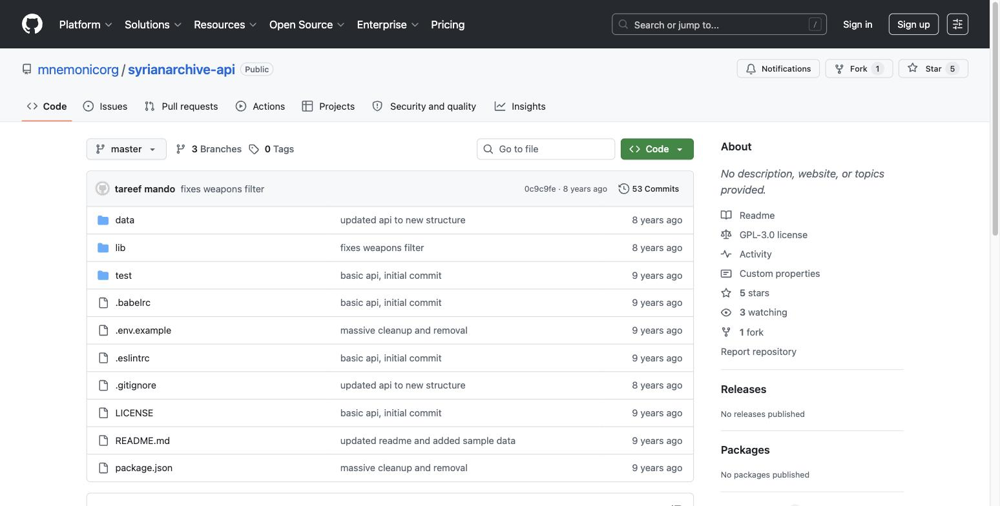

**`mnemonicorg/syrianarchive-api`** — the REST API powering the public database (Express, lodash/fp, fuzzy search). The **unit (video) schema** *is* the tile data model:
```jsonc
{
  "reference_code": "", "relevant": false, "verified": true, "public": false,
  "online_title_en": "", "online_link": "", "description": "",
  "incident_date": "2017-04-30", "incident_time": "11:38:00",
  "location": "", "latitude": "", "longitude": "",
  "online": true, "md5_hash": "b55ddcb2e5f1c24b2dd790d42b09fecd",
  "content_type": "IMAGE", "graphic_content": null,
  "chain_of_custody": "", "date_of_fixity": "",
  "weapons_used": [], "landmarks": [], "collections": ["Attacks against hospitals"],
  "type_of_violation": { "Unlawful_attacks": false, "Use_of_illegal_weapons": false /* …11 boolean categories */ }
}
```
Filter facets are just predicates composed over the set (`lib/filters.js`), and the sidebar's available values are derived from the *current* result set — a clean pattern for always-relevant filter chips:
```js
export const possibilities = us => ({
  weapons:     uniq(flatMap(getOr([], 'clusters.weapons'), us)),
  collections: uniq(flatMap(getOr([], 'clusters.collections'), us)),
  locations:   /* cluster location codes -> human-readable names */,
  type_of_violation: /* which violation booleans are TRUE anywhere */,
});
```
A sibling pipeline plugin, **`sugarcube-plugin-checker`**, periodically re-checks whether archived YouTube videos are **still online** (batched in chunks of 50) — directly reusable as a "source removed / still live" badge.

**Verification-status pattern — THE key transferable idea.** Their status model is **not a single verified/unverified flag** — it's a set of orthogonal dimensions plus provenance:

| Field | Meaning → badge |
|---|---|
| `verified` | Human-verified authentic → "Verified" badge |
| `relevant` | Passed relevance triage (in-scope) |
| `public` | Cleared for public display (vs sensitive/legal-hold) |
| `online` | Source copy still live on the platform (vs "Removed") |
| `graphic_content` | Show blur / interstitial warning |
| `latitude`/`longitude` + `location` | Geolocated → map pin |
| `incident_date` + `upload_date` | Chronolocated |
| `md5_hash`, `chain_of_custody`, `date_of_fixity`, `acquired_from` | Provenance / integrity chain |

Takeaways: model verification as **independent dimensions**, each mapping to a small tile badge; keep an **integrity chain** behind the tile for a "provenance" panel; and distinguish **automated fields** (hash, duration, upload date) from **manual/analyst-set fields** (verification, violation type).

**150–250 word summary.** Mnemonic built a shared open-source stack that scrapes eyewitness video, cryptographically preserves each file with a chain of custody, runs three-step human verification (source, geolocation, chronolocation), and publishes to a public, filterable database — replicated across four archives holding 10M+ records. The public database renders as a **paginated grid of video cards** with a **facet sidebar** (collections, weapons, locations, violation type, date range, fuzzy bilingual search) whose values are computed live from the current result set, alongside a timeline histogram and a clustered map. The API (`syrianarchive-api`, Express + lodash/fp) and pipeline (SugarCube plugins) are open-source; the front-end is not. Three patterns transfer directly: **(1) multi-dimensional verification status** — independent booleans (`verified`, `online`, geolocated via lat/lon, `graphic_content`, `public`), each a small tile badge, backed by a provenance chain (hash + source + fixity date); **(2) result-set-derived filter facets** — generate filter chips dynamically from whatever clips are currently shown (their `possibilities()` function), so filters stay relevant; **(3) clip-to-incident clustering** — many clips of one event roll up to a single geolocated incident with lat/lon and a confidence score, enabling map/timeline views on top of the raw grid, plus a "still online / removed" badge driven by periodic source re-checks.

---

## 3. UI library shortlist

Context: **static site, no backend**, filterable grid of embedded (not rehosted) video tiles with verification-status badges. Each library is tagged **v1** (vanilla / framework-agnostic — the target for this build) or **v2** (React/Next ecosystem, for a future rebuild). Maintenance was checked live where possible (July 2026).

**Honest framing:** there is **no civic-tech-specific UI kit** for this exact job. Newsroom/data-documentary teams overwhelmingly build these tile walls from **general-purpose primitives + native CSS**, not a bespoke framework. So most picks below are general-purpose (flagged as such). The one genuinely project-specific, well-solved category is **video facades**.

**Avoid — once-default but now effectively abandoned:** **Masonry** (desandro, last release 2018), **Isotope** (metafizzy, 2018; also GPL/commercial dual-license), **List.js** (2021). They still run, but don't start a new build on them.

### (a) Layout / grid systems
- **Native CSS Grid (+ CSS Masonry)** — *v1, recommended default.* Zero-dependency, accessible, responsive. For a uniform video-tile wall, `grid-template-columns: repeat(auto-fill, minmax(240px, 1fr))` is likely all you need; native CSS `masonry` is now shipping in Chrome/Safari (2025) for ragged heights. Start here.
- **Masonry Grid (dangreen)** — masonry-grid.js.org — *v1.* ~1.4 kB, framework-agnostic, a modern replacement for desandro/Masonry if you need real masonry with older-browser support. *Maintenance: promoted through 2025 but confirm the repo's commit cadence before adopting.*
- **Shuffle.js (Vestride)** — github.com/Vestride/Shuffle — *v1.* Vanilla JS (no jQuery) that combines **layout + filter + sort** in one library — the modern Isotope successor; a strong single-dependency option if you want grid + tag-filtering together. *Maintenance: verify last-commit date before relying on it.*

### (b) Filter & tag / faceted search
- **Fuse.js (krisk)** — github.com/krisk/fuse — *v1, recommended.* Zero-dependency fuzzy client-side search, ~7 kB, TypeScript. **Ideal for no-backend**: load your clip metadata as a JSON array and filter/search entirely client-side. *Confirmed active: v7.3.0, April 2026.*
- **Shuffle.js** — see (a); also handles tag/faceted filtering with animated layout transitions.
- **Algolia InstantSearch.js** — github.com/algolia/instantsearch — *v2.* Best-in-class faceted-search widgets, but it expects a hosted search index, which **breaks the "no backend" constraint**. Only for v2 if the dataset outgrows client-side search (a self-hostable alternative in that case is **Typesense**).

### (c) Component primitives / status-badge & card components
- **Web Awesome (shoelace-style/webawesome)** — github.com/shoelace-style/webawesome — *v1.* Framework-agnostic **web components** (work in plain HTML), the actively developed successor to Shoelace 2.0; ships `badge`, `card`, `tag`, `tooltip` — exactly the "verification-status badge on a tile" need, no React required. Free core tier. *Active (2025 launch); newer, so expect some churn.*
- **shadcn/ui** — ui.shadcn.com — *v2.* Copy-in Badge/Card/Tabs on Radix + Tailwind; the de-facto React component standard in 2026. The v2 pick if the rebuild goes Next.js. Not for a vanilla v1.
- *(For a single status badge, hand-rolled CSS is genuinely trivial and dependency-free — don't over-reach here.)*

### (d) Animation / interaction
- **Motion (motion.dev, formerly Motion One / Framer Motion)** — *v1 (vanilla build) + v2 (React).* Tiny, built on the Web Animations API, with **both a vanilla-JS API and a React API** — a good "grows with you" choice for fade/stagger on tiles. Very active.
- **GSAP** — gsap.com — *v1 + v2.* Industry-standard animation, **now 100% free including all plugins**; framework-agnostic, heavily used in data journalism. More than a simple grid needs — use for polish only. Very active.
- *(Pure hover/badge states need no library at all — CSS transitions cover them.)*

### (e) Video-embed facades (the project-specific sweet spot)
These load a lightweight thumbnail "facade" and only inject the real YouTube/Vimeo iframe on click — critical for a wall of many embeds (performance + privacy, since no third-party scripts load until interaction). This is the one category with purpose-built, maintained options.
- **lite-youtube-embed (paulirish)** — github.com/paulirish/lite-youtube-embed — *v1, recommended default.* ~1 kB, MIT, drop-in custom element, huge adoption. *Confirmed active: v0.3.4, Nov 2025; 6.3k stars.*
- **lite-youtube web component (justinribeiro)** — github.com/justinribeiro/lite-youtube — *v1.* A shadow-DOM custom-element version; alternative if you prefer a fully encapsulated element. *Last confirmed release v1.9.0, Oct 2024 — verify recency vs paulirish's, which is more recently active.*
- **lite-vimeo-embed (luwes) / lite-vimeo (slightlyoff)** — *v1.* The Vimeo equivalents — needed since a lot of activist/NGO footage (and Forensic Architecture's own) is Vimeo-hosted. *Lower-traffic; confirm commit dates before adopting.*
- **Plyr (sampotts)** — github.com/sampotts/plyr — *v1/v2.* A full accessible player skin over HTML5/YouTube/Vimeo — choose **only if** you need unified custom controls across sources; heavier than a facade. *Maintained at a slower cadence.*

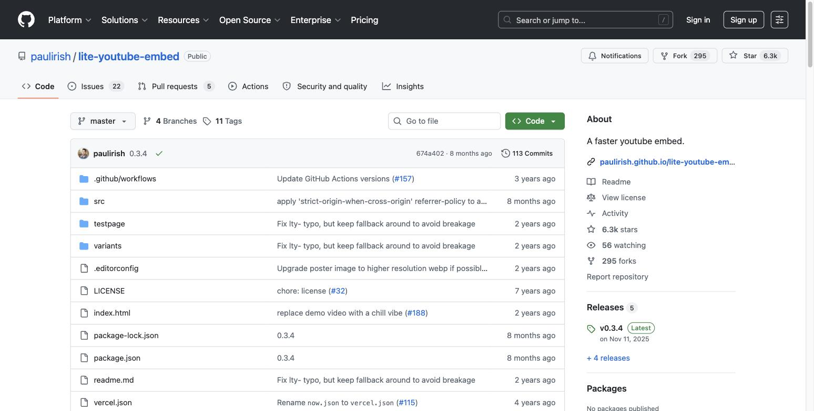

**Confirmed-active shortlist (all checked):** Fuse.js (Apr 2026), lite-youtube-embed (Nov 2025), Web Awesome (2025), GSAP, Motion. **Verify-before-adopting:** masonry-grid, Shuffle.js, lite-vimeo(-embed), Plyr, justinribeiro/lite-youtube. **Avoid (stale):** Masonry, Isotope, List.js.

---

## 4. 3D / WebGL precedents

**The honest headline:** the gold-standard visual-investigation shops — **NYT Visual Investigations, Bellingcat, and most Forensic Architecture case pages** — almost never ship live in-browser WebGL for their reconstructions. They build the 3D in Cinema4D / Blender / Maya and **export it as pre-rendered video** with a scripted camera move, because a locked camera path guarantees it looks right on every device, can't break, and can't be misread by a viewer dragging to a misleading angle. That control is a rhetorical and legal safeguard. Genuine interactive in-browser 3D shows up only in a narrow, deliberate set of cases, with a clear pattern to when it's justified.

**When interactive 3D genuinely earns its place:** (a) when *exploration itself is the evidentiary point* — the viewer needs to verify sightlines/positions themselves; or (b) when a graphics/immersive desk is doing an *experience* piece where wonder is the goal. For a tile wall of protest videos, the lesson is: **3D should be justified by spatial reasoning the viewer actually performs, not by "3D looks impressive."**

### Findings

**NYT Visual Investigations (Day of Rage / Jan 6, Beirut, Bucha, Uvalde)** — delivered as **pre-rendered video**, not WebGL. The 3D spatial synchronisation (placing hundreds of clips in an accurate model) is done in 3D software and rendered out as film. For evidentiary reconstruction this is the *right* call and a strong argument *against* interactive 3D. *(The Day of Rage documentary is public on YouTube; the article is NYT-paywalled.)*

**NYT Graphics / Immersive desk (Graham Roberts)** — this is where real in-browser WebGL lives, but on *experience* pieces (arts/sport/science), not investigations. The "Notre-Dame Comes Roaring Back to Life" piece rendered the cathedral in real-time WebGL in the browser.

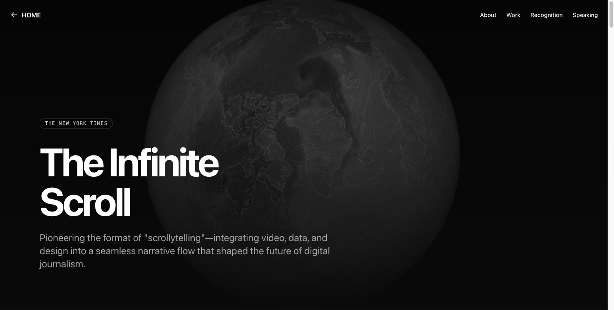
*The portfolio page itself renders a live WebGL globe. Note the split: NYT's investigations desk ships video; the graphics/immersive desk ships live 3D for wonder pieces.*

> **Gap flagged:** the specific 2019 Notre-Dame interactive URL is now a **dead link (Page Not Found)**, not a paywall. The Roberts portfolio above documents the same work.

**Forensic Architecture — the closest precedent, and it's split.** (a) Most case-page reconstructions are **pre-rendered video** (see §2.1). (b) The **Ayotzinapa Platform** (plataforma-ayotzinapa.org) is the standout exception: **genuinely interactive in-browser three.js/WebGL** built on photogrammetry point clouds (decimated in MeshLab, streamed via POP progressive-loading buffers) with a D3 timeline + React/Redux map linking thousands of events in space and time. It's the best evidentiary argument *for* interactive 3D — the whole point is that a user can independently navigate the reconstructed sites, so *exploration is the evidence*. (c) **TimeMap** — FA's open-source tool — is deliberately **2D** (Leaflet + D3) and has real **protest deployments** (e.g. `blmprotests.forensic-architecture.org`). That a protest-incident documentation tool chose 2D map+timeline over 3D is itself a signal.

> **Gap flagged:** the Ayotzinapa site was **unreachable during capture** (no screenshot). Technique details are from its published technical writeup, not a live view.

**Bellingcat — an honest negative.** Their method is overwhelmingly **2D geolocation/chronolocation** (comparing ground media to satellite imagery, shadow/sun analysis). When they do 3D it's Google Earth Pro / SketchUp models screenshotted to prove a sightline — not a live WebGL viewer. Evidence that world-class evidentiary spatial work needs **zero custom 3D**.

**The Pudding / scrollytelling shops — 3D is rare and rarely documentary.** Mostly D3/Canvas/SVG. Where "3D" appears in storytelling (e.g. WaPo/Reuters graphics), it's typically **scroll-scrubbed pre-rendered image sequences**, not live WebGL — more reliable and just as impressive without the fragility. The strongest "3D-as-gimmick" warning: if you're not letting users *manipulate* space for a reason, a scroll-scrubbed pre-render is safer.

### Special flag — 3D network / force-directed graphs (for a future reposting-network view)

- **`3d-force-graph` (vasturiano)** — github.com/vasturiano/3d-force-graph — Three.js/WebGL, GPU-accelerated, handles thousands of nodes.
- **`react-force-graph` (vasturiano)** — github.com/vasturiano/react-force-graph — one React component covering **2D, 3D, VR and AR** force graphs, so you switch dimensionality with a prop. Likely the pragmatic choice.
- **`three-forcegraph`** (drop the graph into your own r3f scene) and **`d3-force-3d`** (the underlying physics) are the lower-level building blocks.

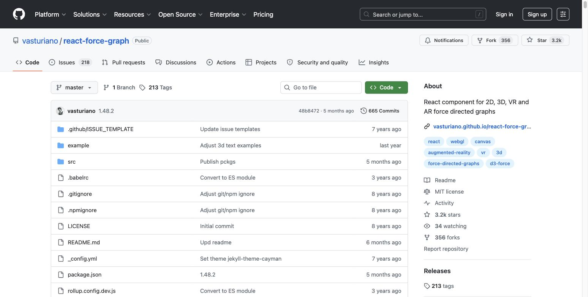

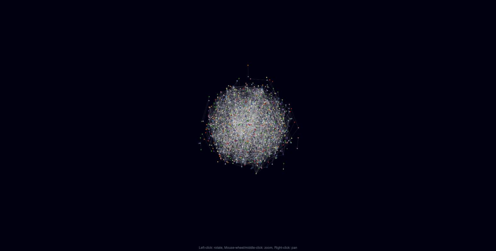
*The demo also illustrates the core problem: at scale, a 3D graph becomes an occluded hairball.*

**Honest read on 3D vs 2D for network graphs:** for actually *reading* a network (finding clusters, hubs, paths), **2D is measurably easier** — no occlusion, labels stay legible, you can screenshot/annotate a static 2D graph. 3D earns its place only for **(1) presentation/impact** (a rotating graph is arresting for a "look how far this spread" moment), **(2) an inherently 3D structure** (bind the third axis to something real — time as depth, platform as a layer), or **(3) very large graphs** where 3D gives more room before clusters overlap. **Recommendation:** prototype with `react-force-graph` (2D and 3D from the same data via a flag), **ship 2D as the analytical default**, and reserve 3D for a presentation view — only if the Z-axis means something. A 3D graph with no meaningful Z-axis is the textbook gimmick to avoid.

### Tooling landscape (quick reference)
- **three.js / react-three-fiber** — bespoke interactive 3D scenes; r3f if the app is already React. Ayotzinapa proves it scales to evidentiary point clouds.
- **deck.gl** — best when data is *geospatial and large* (e.g. ACLED protest data rendered with a hexagon layer — see `dgmurphy/acled-deckgl` below). Pairs with Mapbox/MapLibre.
- **Mapbox GL / MapLibre GL** — 3D terrain + extruded buildings + marker/video overlays, all in-browser WebGL. Strong fit if location is central. **MapLibre is the open (free) fork** — prefer it for a no-cost static build.
- **Cesium** — full-globe real-world-coordinate 3D; heavier, overkill unless you need accurate global geospatial.
- **Google `<model-viewer>`** — dead-simple embeddable interactive 3D/AR for individual `.glb`/USDZ assets (drag-to-rotate, AR on mobile). Best if you have discrete 3D *objects* to show per tile, not a whole environment.
- **Gaussian splatting / photogrammetry viewers** — the evidentiary frontier (reconstruct a physical scene from many photos/videos). Web viewers now exist and peer-reviewed crime-scene-reconstruction accuracy studies are appearing (2026), but it's heavy, capture-dependent, and immature. **Treat as R&D, not a July 2026 ship item.**

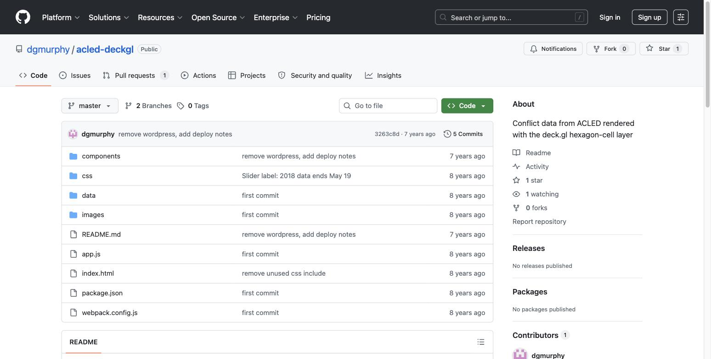

### Bottom line for the tile wall
A wall of video tiles **does not need Three.js to be credible or moving** — the best evidentiary shops deliberately avoid live 3D. A well-composed 2D grid + map + timeline (the TimeMap / scrollytelling baseline) is the proven, honest default. **3D earns its place only if the viewer performs real spatial reasoning** (verifying camera positions, reconstructing a shared physical space — the Ayotzinapa / Gaussian-splat case). For the future network view: **ship 2D by default; make 3D an optional presentation mode with a meaningful Z-axis.**

---

## 5. Recommended stack

### 5.1 v1 — vanilla-first, static, no backend (build this)

The whole thing is a static site deployable to **GitHub Pages / Netlify / Cloudflare Pages**. No server, no database.

**Data layer — a flat JSON manifest (the spine of the whole project).** Model each clip as one record, borrowing Mnemonic's schema and Begley's id-named, manifest-driven approach:
```jsonc
{
  "id": "clip_0001",                       // stable id → deterministic tile↔record mapping
  "title": "…", "description": "…",
  "embed": { "platform": "youtube", "id": "dQw4…" },   // embed, never rehost
  "incident_date": "2026-02-28", "location": "…",
  "latitude": null, "longitude": null,      // presence → "geolocated" badge + future map pin
  "verification": {                         // MULTI-DIMENSIONAL, not one boolean
    "authenticity": "verified",             // verified | unverified | disputed
    "geolocated": true, "chronolocated": false,
    "source_online": true,                  // periodically re-checked → "removed" badge
    "public": true
  },
  "graphic_content": false,                 // → blur / interstitial
  "tags": ["…"], "collections": ["…"],
  "provenance": { "source_url": "…", "acquired_from": "…", "md5_hash": "…", "date_of_fixity": "…" }
}
```

**Rendering & interaction:**
- **Layout:** native **CSS Grid** (`repeat(auto-fill, minmax(...))`). No layout library needed for uniform tiles.
- **Filter / search:** **Fuse.js** for fuzzy search + hand-rolled facet chips **generated from the manifest at load** (Mnemonic's `possibilities()` idea — filters always reflect the current set). If you want layout+filter+sort in one dependency, evaluate **Shuffle.js** (verify maintenance first).
- **Cards & verification badges:** hand-rolled CSS (a badge is trivial) or **Web Awesome** web components. Render **one small badge per verification dimension** (authenticity / geolocated / chronolocated / source-online), plus a **provenance panel** behind the tile.
- **Video tiles:** **lite-youtube-embed** (+ a **lite-vimeo** facade for Vimeo-hosted footage) — lazy facade, embed-not-rehost, keeps a wall of many videos fast and privacy-friendlier.
- **Graphic content:** blur/interstitial driven by the `graphic_content` flag before the facade loads.
- **Animation (optional):** **Motion** (vanilla build) for tasteful fade/stagger — carries into a React v2 unchanged.
- **Sensitive-source handling:** copy FA's labelled-placeholder tile for withheld/removed sources rather than dropping them.

This stack is deliberately small, all-static, and hands cleanly to a Claude Code build session.

### 5.2 v2 — comprehensive stack (when it grows: map, scale, network)

When v1 needs a real map+timeline, larger datasets, or the reposting-network view, graduate to a component ecosystem — still static-exportable:

- **Framework:** **React / Next.js** (static export) — or keep it framework-light with **Astro** (islands) if you want to preserve the static-first ethos while adding interactivity only where needed. Astro is arguably the best *bridge* between v1 and v2.
- **Components:** **shadcn/ui** (Badge / Card / Tabs / Dialog on Radix + Tailwind).
- **Search at scale:** keep **Fuse.js**, or move to **Typesense** (self-hostable) / **Algolia InstantSearch** if client-side search outgrows the browser.
- **Map + timeline (the TimeMap pattern):** **MapLibre GL** (open fork of Mapbox) for the map, **D3** for the synchronised timeline, **supercluster** for marker clustering at scale — mirroring Forensic Architecture's TimeMap architecture, which is the closest working precedent to what you're building.
- **Aggregated protest map:** **deck.gl** layers (hexagon/heatmap) over MapLibre for density views (the ACLED precedent).
- **Reposting-network view:** **react-force-graph** — **2D as the analytical default**, 3D as an optional presentation mode only if the Z-axis is meaningful (time-depth or platform-layer).
- **Animation:** **Motion** or **GSAP** React bindings.
- **Ingestion / verification pipeline (conceptual, borrowed from Mnemonic):** a SugarCube-style pipeline for scraping + a periodic **source-still-online checker**, feeding the same manifest schema. Keep the front-end reading a static manifest even in v2 — the pipeline just regenerates it.
- **Evidentiary 3D (R&D only):** watch **Gaussian splatting / photogrammetry** web viewers for reconstructing a physical protest site from many clips — promising but not production-ready.

**One-line summary of the recommendation:** build v1 as a static, manifest-driven CSS-Grid tile wall with Fuse.js filtering, lite-youtube/vimeo facades, and multi-dimensional verification badges; keep MapLibre-based map+timeline and an optional 2D-default network graph as the v2 growth path.

---

## Appendix — screenshot index

All in `screenshots/`. Captured live in-browser unless noted.

**Forensic Architecture:** `fa_01_homepage_investigations-index.jpg`, `fa_03_case_saydnaya.jpg`, `fa_04_methodology_3d-modelling.jpg`, `fa_05_timemap_github-repo.jpg`. *(Beirut case page not captured — hero video didn't load.)*
**Josh Begley:** `begley_01_homepage_landing.jpg`, `begley_02_project-card-grid.jpg`, `begley_03_officer-involved_tile-grid.jpg`, `begley_04_prison-map_tile-wall.jpg`, `begley_05_satellite-images_github-repo.jpg`.
**Mnemonic / Syrian Archive:** `mnemonic_01_syrian-archive_homepage.jpg`, `mnemonic_02_syrian-archive_investigations-datasets.jpg`, `mnemonic_03_syrian-archive_data-archive-filters-map.jpg`, `mnemonic_04_syrianarchive-api_github-repo.jpg`.
**UI libraries:** `ui_01_lite-youtube-embed_github-repo.jpg`.
**3D / WebGL:** `3d_02_3d-force-graph_large-graph-demo.jpg`, `3d_03_nyt-graham-roberts_immersive-web.jpg`, `3d_04_react-force-graph_github-repo.jpg`, `3d_05_acled-deckgl_github-repo.jpg`. *(Ayotzinapa 3D platform unreachable; NYT Notre-Dame URL is a dead link.)*
